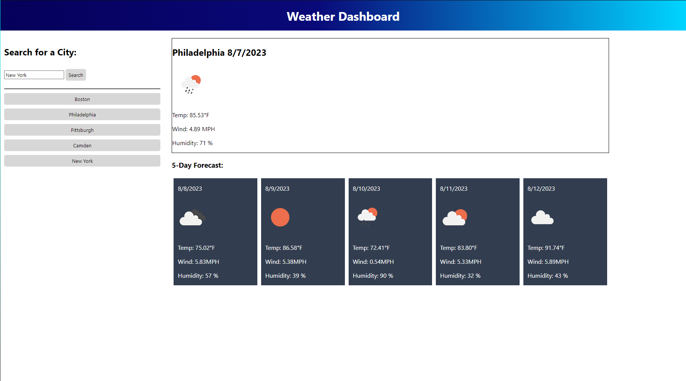
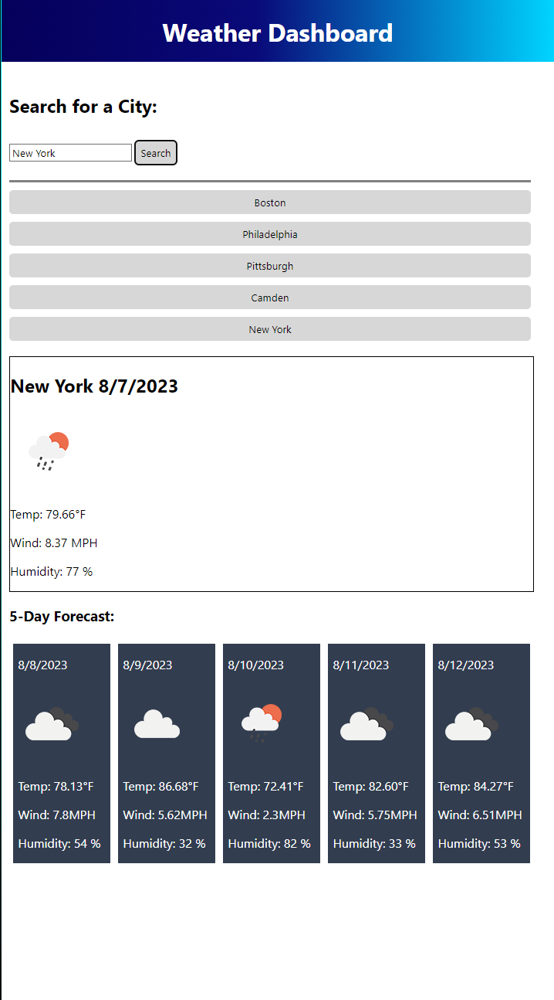

# WeatherChecker

## Description
This is my site to check the weather of a given city. When the user enters a city into the search box and clicks search, they are presented with today's weather as well as the five day forecast for that city. Searching for a city also adds that city to the previous searches and creates a button which when clicked, displays the weather and five day forecast for that city. The data is retrieved from the open weather api and the current date is translated from unix to proper date format using moment. The temperature data is also passed through moment then converted from kelvin to Fahrenheit. The site layout changes if viewed on a smaller screen size. 

[This is a link to the deployed site](https://danmac121.github.io/WeatherChecker/)

